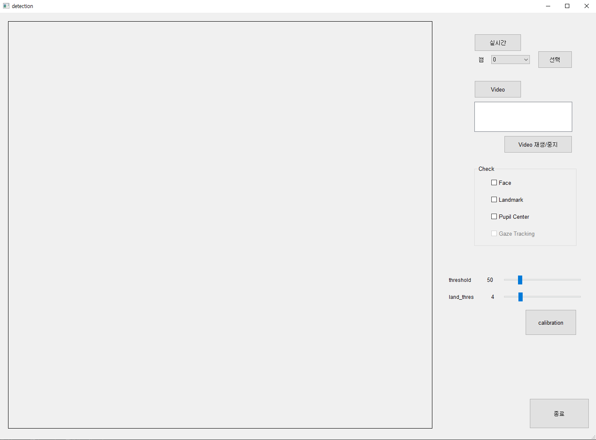

# Face, Landmark, gaze detect SW

## Description

Pyqt를 사용한 얼굴, 랜드마크, 홍채 중심 검출과 시선 추적이 되는 SW 개발

> 실시간 & 비디오 가능   
비디오의 경우에는 시선 추적 기능이 불가능

#### <under>기능 4가지</under>

- 얼굴 검출
    - WIDER FACE dataset을 사용하여 학습
    - MobilenetV1을 backbone으로 한 SSD 모델로 학습 진행
- 랜드마크 검출
    - Dlib 라이브러리 사용하여 얼굴 내 68개 랜드마크 값 detect
- 홍채 중심 검출
    - Landmark 좌표 중 양쪽 눈에 해당하는 이미지를 각각 crop한 후, crop된 이미지에서 전처리를 수행하여 홍채 중심 좌표 검출
- 시선 추적
    - 캘리브레이션 과정을 거쳐 얻은 홍채 중심 좌표와 마우스 클릭 포인트를 선형 회귀 모델로 학습하여 tracking
  

## Demo